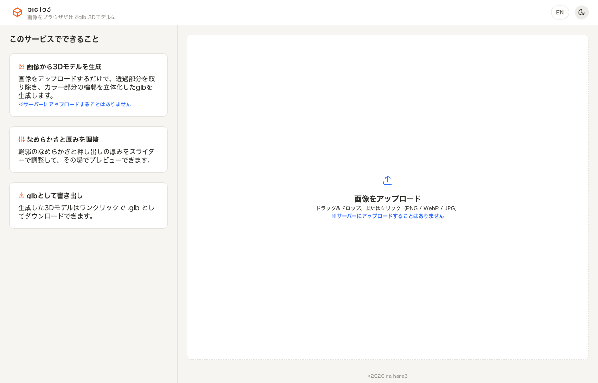
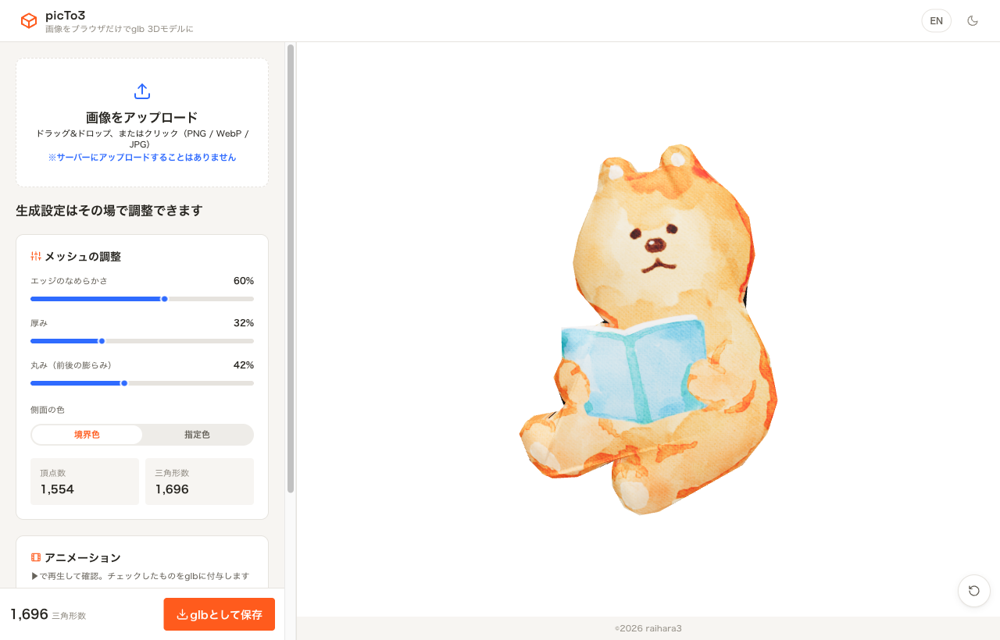
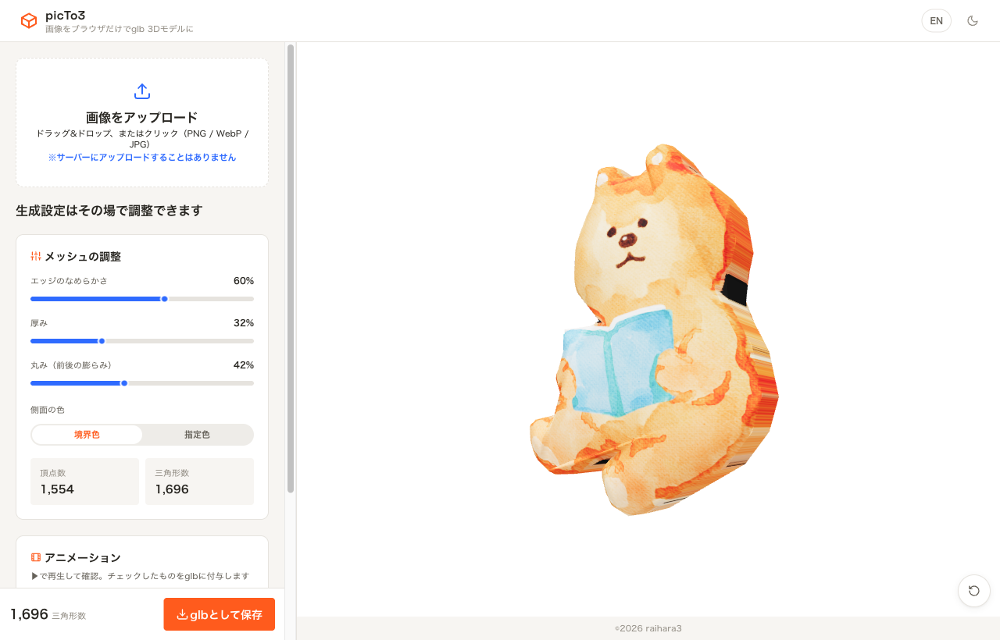
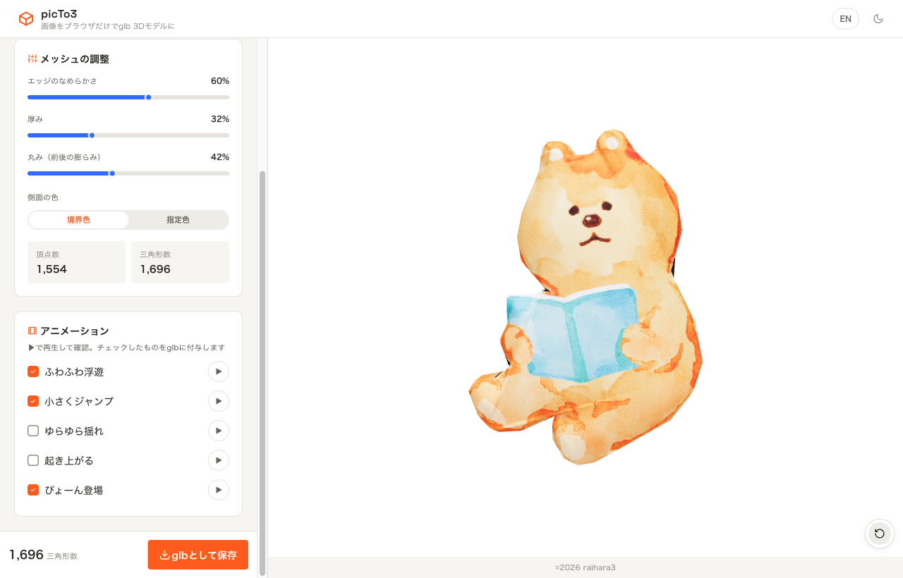

# 2D画像を“ぷっくり3D”に。ブラウザだけで完結するglb変換ツール「picTo3」を作りました

AIで3Dモデルもサクッと作れる時代になりました。でも——

- イラストやロゴなど、**2D画像の“味”はそのまま3Dにしたい**
- AI生成だと**形が崩れて**、思ったものにならない
- 簡易デモ用に、とにかく**サクッと**用意したい

そんな時に使える、画像1枚から3Dモデル（`.glb`）をつくるツール **picTo3（ぴくとすりー）** を作りました。
ブラウザだけで動き、**画像はサーバーに一切送りません**。しかも**アニメーションまで**つけられます。

> 🔗 デモ: `<公開URL をここに>`
> 🔗 ソース: https://github.com/raihara3/picTo3

---

## picTo3って何？

ひとことで言うと、**「透過PNGなどの画像をアップすると、その形をそのまま立体化して glb で書き出せる」** Webツールです。

- 画像の**透過部分を取り除き**、色がある部分の**輪郭だけを立体化**
- ピクセルごとに頂点を作らないので、**軽いメッシュ**
- なめらかさ・厚み・丸み・側面の色を**スライダーでその場調整**
- 5種類の**アニメーション**を選んで glb に付与
- 処理は全部**ブラウザ内で完結**（サーバー送信なし）

たとえば、この水彩タッチのクマのイラスト（透過PNG）を入れると……

こんな“ぷっくり”した立体に。**元の絵の形も色も、水彩の風合いもそのまま**、立体になります。ぐりぐり回すと、ちゃんと厚みと丸みのある3Dだとわかります。

---

## こんな時におすすめ

### ① 2D画像の良さを残したい

AIの3D生成は強力ですが、「元のイラストの雰囲気」とは別物になりがち。
picTo3は**輪郭をそのまま押し出す**だけなので、絵の形・色・シルエットが崩れません。ロゴやアイコン、キャラのワンポイントを“そのまま”立体にしたい時にぴったりです。

### ② AI生成だと崩れてしまう

「この形をこのまま3Dにしたいだけなのに、AIだと余計なアレンジが入る…」という時。
picTo3は**決定的**（同じ画像 → 同じ結果）なので、**思った通りの形**が手に入ります。

### ③ 簡易デモにサクッと使いたい

AR/Webの簡易デモ、プロトタイプのプレースホルダーに。
**画像を入れて、スライダーを触って、保存するだけ。** 数十秒で glb が手に入ります。

---

## 使い方は3ステップ

1. **画像をアップロード**（ドラッグ&ドロップ or クリック。PNG / WebP / JPG）
2. **スライダーで調整**：エッジのなめらかさ／厚み／丸み（前後の膨らみ）／側面の色
3. **「glbとして保存」** でダウンロード

丸みを最大＋厚みを薄くすれば、**まん丸のボール**っぽくもできます。逆に丸み 0 ならフラットな板。用途に合わせて自在です。

---

## アニメーションも“選ぶだけ”

立体にしたら、動かしたくなりますよね。picTo3には5種類のアニメが内蔵されていて、**チェックしたものを glb に付与**できます。

- **ふわふわ浮遊** … ゆっくり上下に
- **小さくジャンプ** … 定期的にぴょん
- **ゆらゆら揺れ** … 左右にゆらゆら
- **起き上がる** … 寝ている状態から手前に起き上がる
- **ぴょーん登場** … 拡大しながらジャンプして着地

▶ で確認して、必要なものにチェック。書き出した glb には**名前付きアニメーション**として入るので、対応ビューアやゲームエンジンでそのまま再生できます。
（原点をオブジェクトの下端に置いているので、回転や着地の動きが自然になります）

---

## “安心＆速い”の理由：全部ブラウザで完結

picTo3は**画像を一切サーバーに送りません**。読み込み・輪郭抽出・立体化・書き出しまで、**すべてブラウザ内**で処理します。だから——

- **セキュリティ的に安心**（社外に出せない素材でもOK）
- **速い**（アップロード待ちがない）
- **アカウント登録も不要**

---

## 技術メモ（興味がある人向け）

- **Next.js（App Router）＋ three.js**、ホスティングは **Vercel**
- 画像 → アルファでマスク → **輪郭を追跡**して閉ループ化 → Douglas–Peucker ＋ Chaikin で簡略化＆平滑化 → `ExtrudeGeometry` で厚みづけ
- **ピクセル単位で頂点を作らない**ので、メッシュが軽い
- 丸みは**境界からの距離場**でキャップを膨らませて表現（円なら正確に半球＝ボール）
- 透過部分の色を数px 染み出させて、縁の黒フチを防止
- 書き出しは three の `GLTFExporter`。アニメは手続き的な `AnimationClip` をコードで生成

---

## まとめ

- **2D画像の形と色をそのまま** 3D（glb）に
- なめらかさ・厚み・丸みをその場調整、しかも**軽いメッシュ**
- **アニメーション付き**で書き出し
- **サーバーに送らない**から、安心＆速い

「AIの3D生成ほどガッツリじゃないけど、この絵をサッと立体にしたい」——そんな場面でぜひ使ってみてください。

> 🔗 デモ: `<公開URL をここに>`
> 🔗 ソース: https://github.com/raihara3/picTo3

---

*※ この記事の画像は `docs/images/` に置いています。note に投稿する際は、各画像をアップロードして差し込んでください。*
